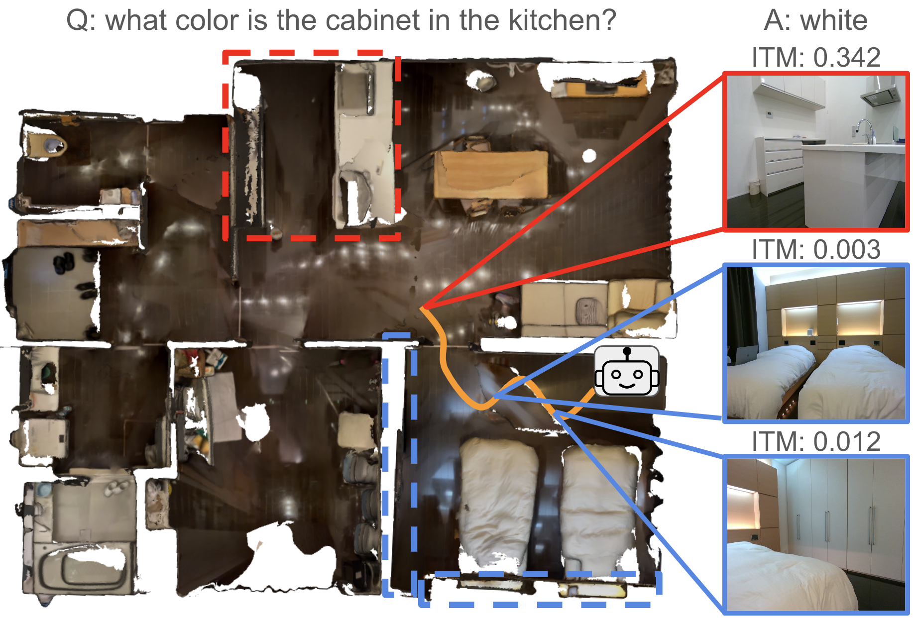

# Map-based Modular Approach for Zero-shot Embodied Question Answering

[[arxiv](https://arxiv.org/abs/2405.16559)]
[[project](https://ATR-DBI.github.io/Map-EQA/)]
[[bibtex](#citing-our-paper)]

<p align="center"></p>

This is the official repository of our paper Map-based Modular Approach for Zero-shot Embodied Question Answering (IROS 2024) by Koya Sakamoto, Daichi Azuma, Taiki Miyanishi, Shuhei Kurita, and Motoaki Kawanabe.

## Abstract

Embodied Question Answering (EQA) serves as a benchmark task to evaluate the capability of robots to navigate within novel environments and identify objects in response to human queries. However, existing EQA methods often rely on simulated environments and operate with limited vocabularies. This paper presents a map-based modular approach to EQA, enabling real-world robots to explore and map unknown environments. By leveraging foundation models, our method facilitates answering a diverse range of questions using natural language. We conducted extensive experiments in both virtual and real-world settings, demonstrating the robustness of our approach in navigating and comprehending queries within unknown environments.

## Dataset Preprocess

We used the *gpt-35-turbo-0613* through the Azure OpenAI API to extract an object category with a prompt. We also use the *gpt-35-turbo-0613* for converting questions into declarative sentences for image-text matching (ITM).

First, you have to download [eqa dataset](https://github.com/facebookresearch/habitat-lab/blob/main/DATASETS.md#task-datasets) and [mp3d scenes](https://github.com/facebookresearch/habitat-sim/blob/main/DATASETS.md#matterport3d-mp3d-dataset) and place them as follows:

```
data/
  ├── scene_datasets/
  │   ├── mp3d/
  │       ├── 1LXtFkjw3qL
  │       │     ├── 1LXtFkjw3qL_semantic.ply
  │       │     ├── 1LXtFkjw3qL.glb
  │       │     ├── 1LXtFkjw3qL.house
  │       │     └── 1LXtFkjw3qL.navmesh
  │       ├── ...
  │
  ├── train.json.gz
  └── val.json.gz
```


Next, you can run the code below to preprocess the downloaded dataset.

```bash
bash scripts/preprocess.sh
```

Please make sure that you set the correct apikey file path in the file. After running the preprocess.sh, the directory architecture is like below:

```
data/
  ├── scene_datasets/
  │   ├── mp3d/
  │       ├── 1LXtFkjw3qL
  │       │     ├── 1LXtFkjw3qL_semantic.ply
  │       │     ├── 1LXtFkjw3qL.glb
  │       │     ├── 1LXtFkjw3qL.house
  │       │     └── 1LXtFkjw3qL.navmesh
  │       ├── ...
  │
  ├── datasets/
  │   └── eqa/
  │       └── mp3d/
  │           └── v1/
  │               └── val/
  │                   ├── val.json.gz
  │                   └── content/
  │                       ├── 2azQ1b91cZZ.json.gz
  │                       ├── ...
  │
  ├── train.json.gz
  └── val.json.gz
```

## Baselines and Automatic Evaluation

### Installation

First, clone with submodules:

```bash
git clone git@github.com:K0uya/Map-EQA.git --recurse-submodules
```

Second, download a Detic weight:

```bash
cd libs/Detic
mkdir models
wget https://dl.fbaipublicfiles.com/detic/Detic_LCOCOI21k_CLIP_SwinB_896b32_4x_ft4x_max-size.pth -O models/Detic_LCOCOI21k_CLIP_SwinB_896b32_4x_ft4x_max-size.pth
cd ../..
```

Our code is based on SemExp and PONI. We recommend using conda:

```bash
conda create -n map_eqa2 python=3.7 cmake=3.14.0 -y
conda activate map_eqa2
conda install -c conda-forge cudatoolkit=11.1.1 -y
pip install --upgrade pip
pip install --upgrade setuptools
pip install cython pkgconfig trimesh h5py einops scikit-learn urllib3==1.26.16 google-auth
conda install -c anaconda hdf5 -y
cd libs/habitat-lab-v0.2.1
pip install -e .
cd ../..
conda install https://anaconda.org/aihabitat/habitat-sim/0.2.1/download/linux-64/habitat-sim-0.2.1-py3.7_headless_bullet_linux_fc7fb11ccec407753a73ab810d1dbb5f57d0f9b9.tar.bz2
python -m pip install detectron2 -f \
  https://dl.fbaipublicfiles.com/detectron2/wheels/cu111/torch1.10/index.html
pip install salesforce-lavis opencv-python==4.8.0.74 scikit-fmm centernet2 openai-clip
conda install conda-forge::timm
pip install torch==1.10.1+cu111 torchvision==0.11.2+cu111 torchaudio==0.10.1 -f https://download.pytorch.org/whl/cu111/torch_stable.html
pip install --upgrade charset_normalizer
cd libs/astar_pycpp
make
cd ../..
```

### Running baseline

Our baseline is run as follows:

```bash
bash scripts/eval_map_eqa.sh
```

**When you encouter memory errors, you can adjust the arguments such as *dividion_num, dividion_num_first_gpu* to bigger ones. These arguments contribute to a thread number in parallel.**

### Results

You can run the code below to calculate the mean of VQA Top-1 accuracy and other metrics for navigation.

```bash
bash scripts/log_vis.sh
```

## License

MapEQA is released under the [MIT License](LICENSE).

## Contributors

Koya Sakamoto, Daichi Azuma, Taiki Miyanishi, Shuhei Kurita, Motoaki Kawanabe

## Citing our paper

If you find this project useful for your research, please use the following BibTeX entry.

```tex
@inproceedings{sakamoto2024mapeqa,
  author={Koya Sakamoto, Daichi Azuma, Taiki Miyanishi, Shuhei Kurita, Motoaki Kawanabe},
  title={Map-based Modular Approach for Zero-shot Embodied Question Answering},
  booktitle={Proceedings of the IEEE/RSJ International Conference on Intelligent Robots and Systems (IROS)},
  year={2024},
}
```

## Acknowledgements

This repository uses [devendrachaplot](https://devendrachaplot.github.io/)/[Object-Goal-Navigation](https://github.com/devendrachaplot/Object-Goal-Navigation) and [Habitat Lab](https://github.com/facebookresearch/habitat-lab) implementation for running environments. The implementation of a frontier exploration is borrowed from [srama2512](https://srama2512.github.io/)/[astar_pycpp](https://github.com/srama2512/astar_pycpp/tree/7b1e9ea2413b30feca8d457fefbff2ef94da37cb). The semantic segmentation implementation is based on the [Detic](https://github.com/facebookresearch/Detic) repository. We would also like to thank the authors.
